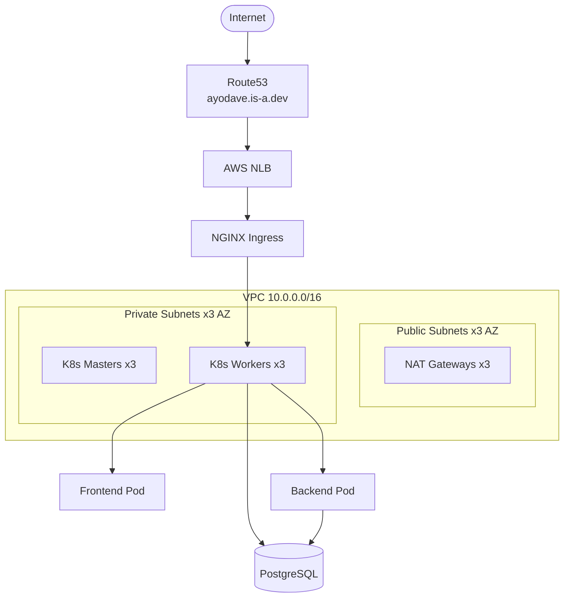
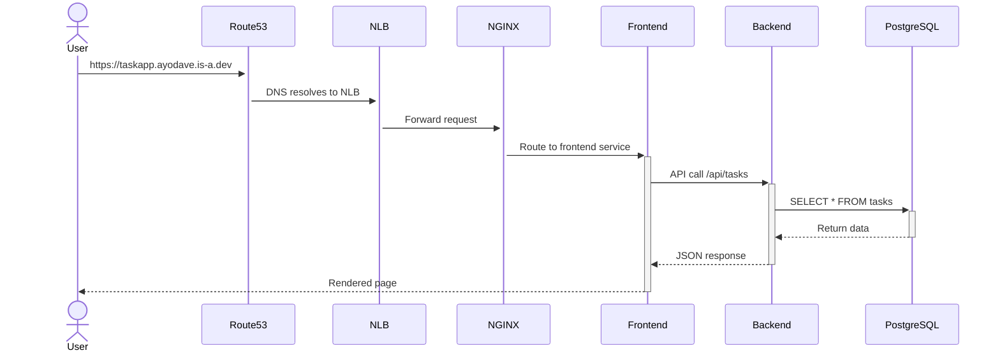
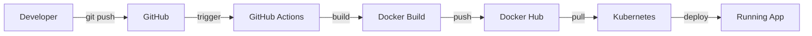
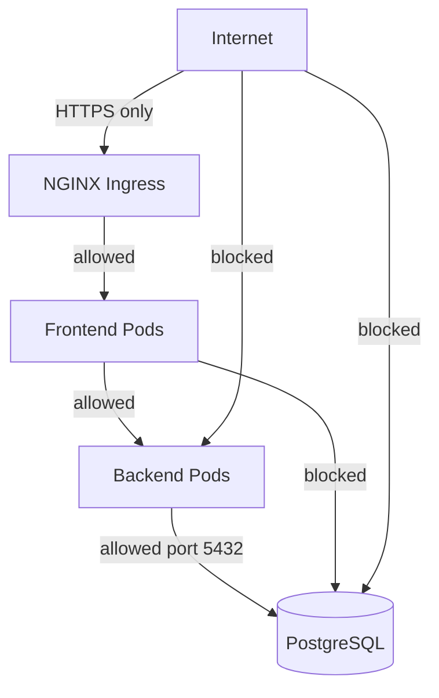
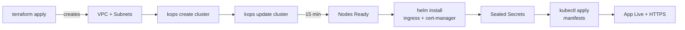

Architecture Diagrams

1. AWS Infrastructure Overview

```mermaid
graph TB
    Internet([Internet]) --> R53[Route53\nayodave.is-a.dev]
    R53 --> NLB[AWS NLB]
    NLB --> NGINX[NGINX Ingress]
    
    subgraph VPC["VPC 10.0.0.0/16"]
        subgraph Public["Public Subnets x3 AZ"]
            NAT[NAT Gateways x3]
        end
        subgraph Private["Private Subnets x3 AZ"]
            Masters["K8s Masters x3"]
            Workers["K8s Workers x3"]
        end
    end
    
    NGINX --> Workers
    Workers --> FE[Frontend Pod]
    Workers --> BE[Backend Pod]
    Workers --> DB[(PostgreSQL)]
    BE --> DB
```

2. Application Request Flow

```mermaid
sequenceDiagram
    actor User
    User->>+Route53: https://taskapp.ayodave.is-a.dev
    Route53->>+NLB: DNS resolves to NLB
    NLB->>+NGINX: Forward request
    NGINX->>+Frontend: Route to frontend service
    Frontend->>+Backend: API call /api/tasks
    Backend->>+PostgreSQL: SELECT * FROM tasks
    PostgreSQL-->>-Backend: Return data
    Backend-->>-Frontend: JSON response
    Frontend-->>-User: Rendered page
```

3. CI/CD Pipeline Flow

```mermaid
graph LR
    Dev[Developer] -->|git push| GH[GitHub]
    GH -->|trigger| GA[GitHub Actions]
    GA -->|build| DB[Docker Build]
    DB -->|push| DH[Docker Hub]
    DH -->|pull| K8S[Kubernetes]
    K8S -->|deploy| APP[Running App]
```

4. Network Security Flow

```mermaid
graph TD
    I[Internet] -->|HTTPS only| NG[NGINX Ingress]
    NG -->|allowed| FE[Frontend Pods]
    FE -->|allowed| BE[Backend Pods]
    BE -->|allowed port 5432| DB[(PostgreSQL)]
    FE --->|blocked| DB
    I --->|blocked| BE
    I --->|blocked| DB
```

5. Deployment Sequence

```mermaid
graph LR
    TF[terraform apply] -->|creates| VPC[VPC + Subnets]
    VPC --> KC[kops create cluster]
    KC --> KU[kops update cluster]
    KU -->|15 min| RD[Nodes Ready]
    RD --> HM[helm install\ningress + cert-manager]
    HM --> SS[Sealed Secrets]
    SS --> KA[kubectl apply\nmanifests]
    KA --> LIVE[App Live + HTTPS]
```
